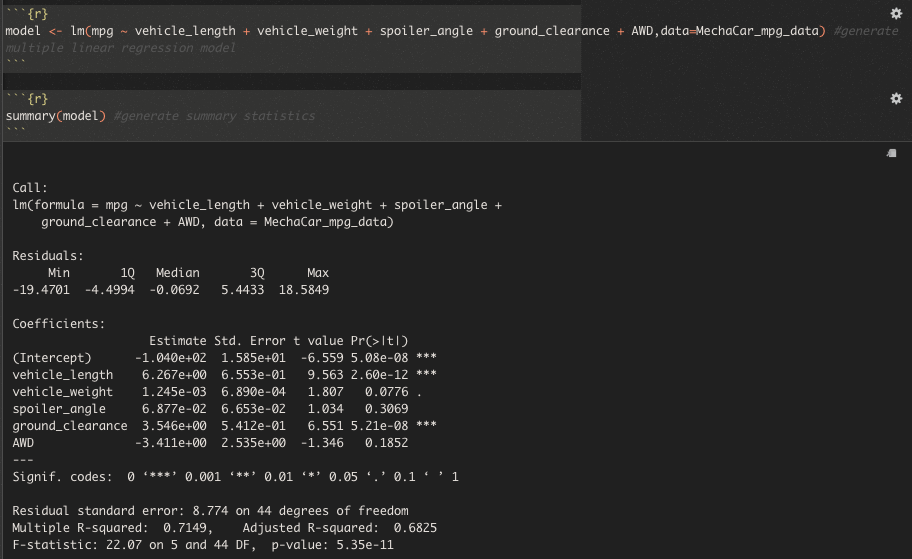
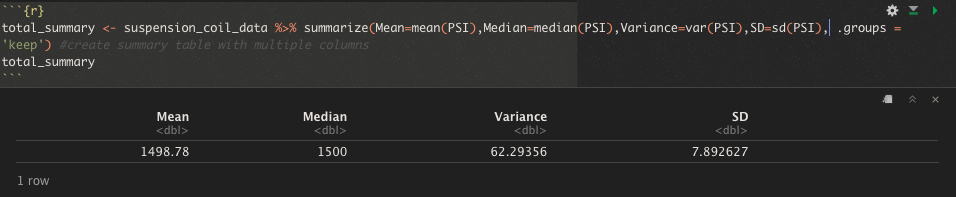
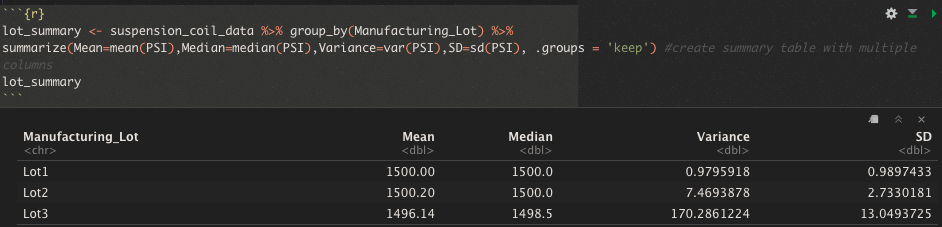
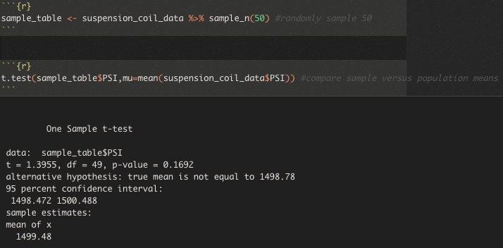
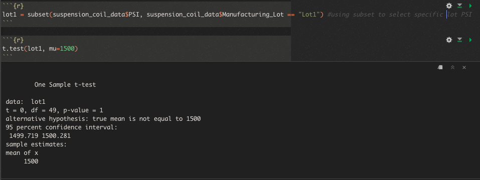
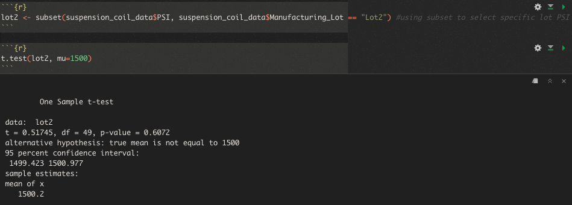
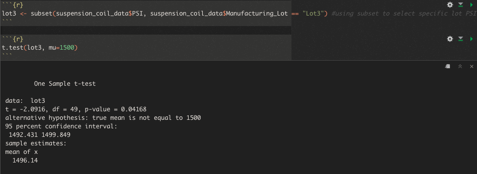

# Overview
This project demonstrates how to perform multiple linear regression analysis to identify which variables in the dataset predict the mpg of AutosRUS' newest prototype, the MechaCar.

## Deliverable 1
## Linear Regression to Predict MPG
Following is the output of Multiple Linear Regression performed in R:

This output addresses the following questions:

1 - Which variables/coefficients provided a non-random amount of variance to the mpg values in the dataset?

Intercept, vehicle length and ground clearance since their p-value is less than 0.05. Vehicle length and ground_clearance have high t-values as well, 9.563 & 6.551 respectively.

2 - Is the slope of the linear model considered to be zero? Why or why not?
None of the slopes are zero.

3 - Does this linear model predict mpg of MechaCar prototypes effectively? Why or why not?

This linear model doesn't predict mpg of MechaCar prototypes effectively since the intercept is statistically significant which means that there are other variables and factors that contribute to the variation in mpg that have not been included in our model.

## Deliverable 2
## Summary Statistics on Suspension Coils
Looking at the overall summary, the variance is less than 100 pounds per square inch, which means that the overall manufacturing data meets the design specification:

Total Summary:

However, looking at the individual lot data, we can see that the variance for Lot3 data is higher than 100 pounds pwer square inch i.e. 170.29, which means that it does not meet the design specification.

## Deliverable 3
## T-Tests on Suspension Coils
If we look at the t-test summary across all manufacturing lots, the p-value is slightly higher than 0.05 which means that the PSI across all manufacturing lots is statistically similar to the population mean of 1,500 pounds per square inch.

If we look at the t-test summary of Lot1, the p-value is higher than 0.05 which means that the PSI of Lot1 is also statistically similar to the population mean of 1,500 pounds per square inch.

If we look at the t-test summary of Lot2, the p-value is higher than 0.05 which means that the PSI of Lot2 is also statistically similar to the population mean of 1,500 pounds per square inch.

If we look at the t-test summary of Lot3, the p-value is less than 0.05 which means that the PSI of Lot3 is statistically different to the population mean of 1,500 pounds per square inch.

## Deliverable 4
## Study Design: MechaCar vs Competition
Following metrics/independent variables can be tested:
- MPG
- City or Hwy Fuel Efficiency
- Transmission
- Horse Power
- AWD
- National Highway Traffic Safety Administration rating

Cost would be the dependent variable as it can be used to compare MechaCar against Competitor for the same values of abovementioned metrics.

Null Hypothesis:
The mean price of MechaCar is higher than the competitor

Alternate Hypothesis:
The mean price of MechaCar is less than or equal to competitor

T-test can be used to reject null hypothesis.

Dataset in CSV file containing information about above metrics from MechaCar and competitors would be required to perform the analysis.

